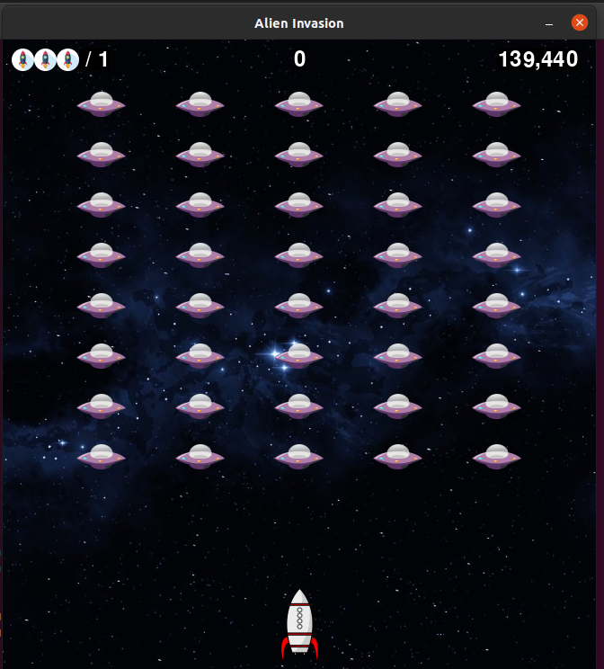
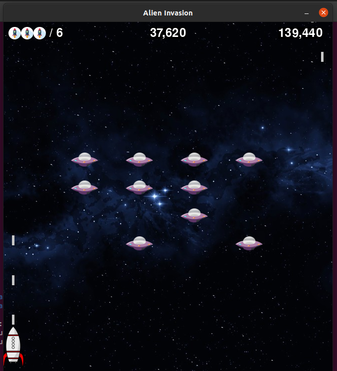
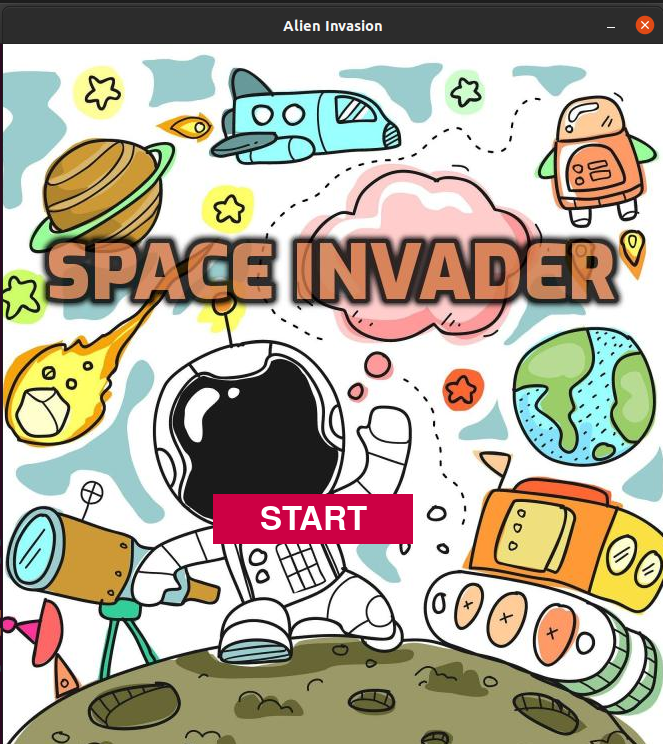

# space_invader
A fixed shooter arcade game.

## Table of contents
* [General info](#general-info)
* [Technologies](#technologies)
* [Illustrations](#illustrations)
* [Features](#features)
* [Inspiration](#inspiration)

## General info
In Space_Invader player controls an anti-satellite missile system moving it horizontally across the bottom of the screen and firing at invading aliens. 

## Technologies
Project is created with:
* Pygame version: 2.0.0.dev10
* Python version: 3.8.5

## Illustrations

## Features
* Aim is to defeat battalion of forty aliens.
* Player defeats an alien and earns points by shooting it.
* After each level aliens' movement and the hit point both boost up.
* If aliens reach the bottom or collide with spaceship, the mission will fail.

## Inspiration
This game is inspired by Space Invaders, a 1978 arcade game created by Tomohiro Nishikado.

